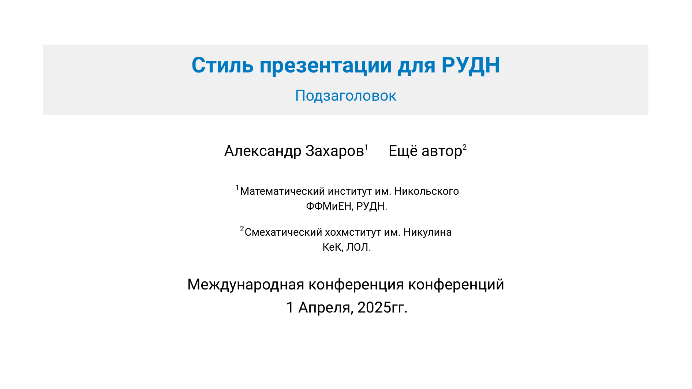
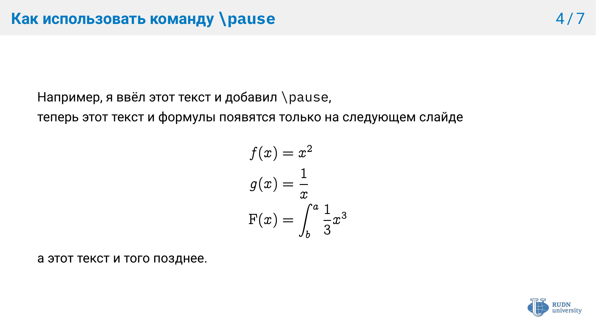
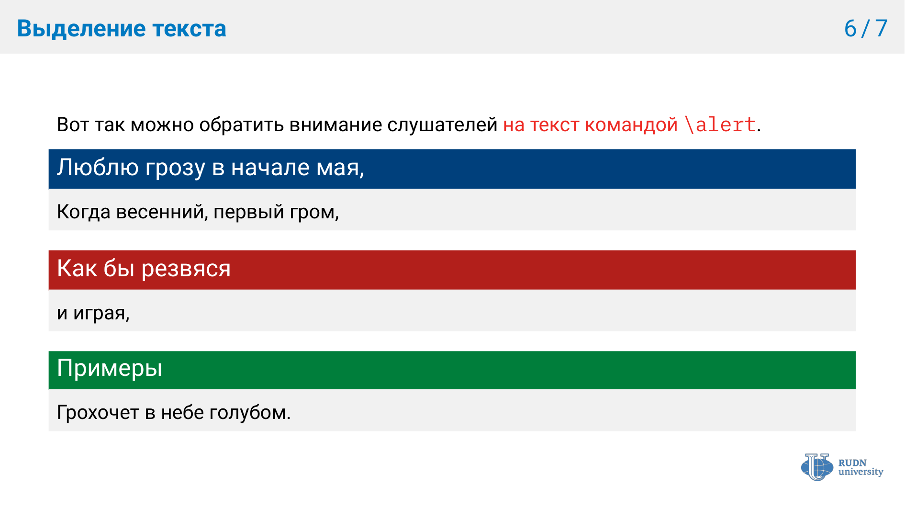

# RUDN Beamer Theme

Небольшой шаблон презентации на классе `beamer` с фирменными цветами и оформлением РУДН.
В репозитории есть пример `demo.tex`, Makefile для сборки и локальная конфигурация `latexmk`.

## Характеристики макета

- Официальная цветовая схема РУДН (синий, красный и зеленый взяты из официального брендбука)
- Минималистичный дизайн с хорошей типографикой
- Соотношение сторон 16:9

> [!NOTE]
> Соотношение сторон меняется в самом начале документа `\documentclass[10pt, hyperref={bookmarks=true}, aspectratio=169]{beamer}`, достаточно изменить 169 на 43 (16 к 9 поменяется на 4 к 3)


## Пример презентации








## Требования

> [!IMPORTANT]
> **Настоятельно рекомендуется установить полный пакет дистрибутива LaTeX на вашу систему.**
> Для Windows - это MikTeX, для macOS - MacTeX, для большинства дистрибутивов Linux - TeX Live.

Если вы по каким-то причинам не можете этого сделать, то необходимый минимум установленного ПО примерно такой:

- Рекомендуется использовать LuaLaTeX (XeLaTeX не проверялся)
- Установленные пакеты: beamer, polyglossia, microtype, fontspec, unicode-math, setspace
- Установленные (желательно через систему пакетов LaTeX) шрифты:
  - Roboto (основной)
  - IBM Plex Mono (моноширинный)
  - Concrete Math (математический)

Также требуются:

- Утилита `latexmk`
- GNU `make` (по умолчанию есть в Linux/macOS)

## Использование темы

> [!IMPORTANT]
> Рекомендуется не копировать файлы в свою директорию, а клонировать этот репозиторий и редактировать лежащий в папке файл `main.tex`

## Сборка презентации

### Через `make`

По умлочанию будет скомпилирован файл `main.tex`, лежащий в текущей директории.
Все вспомогательные файлы (`.aux`, `.log`, `.toc`, и т.п.) складываются в подкаталог `build/`
(будет создан автоматически при первой сборке), итоговый PDF лежит в корне проекта.

Базовая команда:

```bash
make
```

Итог: будет получен `main.pdf`.

#### Изменение основного файла

В Makefile задана переменная `FILE`:

```make
FILE = demo
```

Если нужно собрать другой файл, можно передать его имя из командной строки:

```bash
make FILE=demo
# или явно:
make FILE=demo.tex
```

Аналогично это работает и для других команд (`clean`, `preview` и т.д.):

```bash
make FILE=demo preview
make FILE=demo clean
```

> [!NOTE]
> Например, чтобы скомпилировать доступный в репозитории файл `demo.tex` необходимо написать `make FILE=demo`

#### Доступные команды make

```bash
make            # Компиляция PDF (по умолчанию FILE=demo)
make preview    # Непрерывная компиляция (latexmk -pvc) --- обновление при изменении файлов
make clean      # Удалить вспомогательные файлы (PDF остаётся)
make distclean  # Полная очистка: вспомогательные файлы + PDF + каталог build
```

Makefile настроен на использование `latexmk` с движком `lualatex`, поэтому
количество компиляций подбирается автоматически (содержание, ссылки и т.п.
обновляются как надо).

### Напрямую через `latexmk`

Если не хочется пользоваться `make`, можно собрать презентацию напрямую:

```bash
latexmk demo.tex
```

или явно указать движок:

```bash
latexmk -lualatex demo.tex;
latexmk -pdflatex demo.tex;
```

`latexmk` уже настроен (в файле `.latexmkrc`) так, чтобы:

- использовать `lualatex` с нужными опциями (`-interaction=nonstopmode`);
- складывать вспомогательные файлы в подкаталог `build/`;
- при необходимости вызывать `bibtex`/`biber`;
- обрабатывать ссылки и оглавление

## Лицензия

Проект распространяется под лицензией MIT
